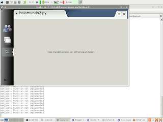

Title: Hola mundo 2da versión con hildon y python
Date: 2008-23-03 10:40
Category: Debian, maemo, Nokia N810, Python

La segunda versión del hola mundo se basará en el framework 
hildon el cual permite manejar el look,temas del entorno de 
maemo, acceso a barra de herramientas y menus.

```
#!/usr/bin/env python2.5

import gtk
import hildon

window = hildon.Window()
window.connect("destroy", gtk.main_quit)
label = gtk.Label("Hola mundo!")
window.add(label)

label.show()
window.show()

gtk.main()
```

Captura de pantalla de la ejecución del script:



