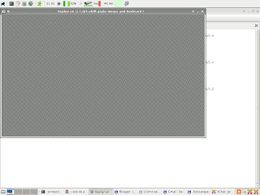
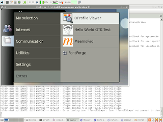

Title: Instalando Maemo-SDK shinook en Debian
Date: 2010-23-03 10:20
Category: Debian, maemo, Nokia N810

Continuando con los post sobre el Nokia N810, ahora a explicar 
el proceso de instalación del kit de desarrollo en Debian.
Me basé en una [guía](http://linuxuk.blogspot.com/2008/01/installing-os2008-development.html) donde explican la instalación del ambiente 
de desarrollo para el OS2008 en Ubuntu.

### Instalación de scratchbox

1. Bajar Maemo-scratchbox
```
wget http://repository.maemo.org/stable/4.0.1/maemo-scratchbox-install_4.0.1.sh
```

2. Colocarle permisos de ejecución
```
chmod +x maemo-scratchbox-install_4.0.1.sh
```

3. Ejecutar el script
```
./maemo-scratchbox-install_4.0.1.sh -d
```

Se instalará scratchbox adaptado para usarlo con maemo.

Se creará un directorio en la raíz del FS con el nombre de scratchbox. En el 
estará toda la estructura necesaria para trabajar con la arquitectura que 
usa el Nokia N810.

4. Crear el usuario que trabajará con scratchbox
```
/scratchbox/sbin/sbox_adduser USERNAME yes
```

El USERNAME es el usuario que trabajará con el kit de desarrollo, preferiblemente 
un usuario con cuenta en el equipo.

5. Actualizar la lista de usuarios relacionada al archivo /etc/groups
```
newgrp sbox
```

6. Iniciar sesión en scratchbox

Desde el usuario que se le creo la cuenta en scratchbox ejecutar:
```
/scratchbox/login
```

Si no dió mensajes de error la instalación fue perfecta.

Se sale con el comando exit.

7. Editar nsswitch.conf

Ejecutar como root

```
nano /scratchbox/etc/nsswitch.conf
```

Tiene que aparecer la siguiente línea

```
hosts: files dns
```

8. Agregar los servidores de nombres en el resolv.conf de scratchbox
```
/scratchbox/login
nano /etc/resolv.conf
```

En mi caso:
```
nameserver 200.47.79.2
nameserver 200.47.79.3
```

Ya con esta se tiene todo listo para instalar maemo.

### Instalación de maemo-sdk.

Todo esto se hace desde el usuario que tiene la cuenta en scratchbox.

1. Bajar el script maemo-sdk-install
```
wget http://repository.maemo.org/stable/4.0.1/maemo-sdk-install_4.0.1.sh
```

2. Colocar el script ejecutable
```
chmod +x maemo-sdk-install_4.0.1.sh
```

3. Ejecutar el script
```
./maemo-sdk-install_4.0.1.sh
```

En este punto se va a crear el ambiente para la instalación. Se acepta la 
licencia de los binarios de nokia y se recomienda hacer una instalación de 
maemo con el ambiente de desarrollo sin los paquetes de depuración.

Se tardará un tiempo en la instalación de paquetes, al terminar ya se 
tiene un ambiente de desarrollo.

4. Instalar xserver-xephyr en el equipo.

5. Actualizar maemo.
```
/scratchbox/login
apt-get update
apt-get dist-update
```

6. Iniciar el servidor X xephyr.
```
Xephyr :2 -host-cursor -screen 800x480x16 -dpi 96 -ac
```

Con este comando se arranca un servidor X xephyr para maemo.
Aparecerá un servidor X con la resolución de 800x480 como en la captura de pantalla.




7. Visualizar maemo en el servidor X xephyr.

Ejecutar en la sesión de scratchbox lo siguiente:
```
export DISPLAY=:2
af-sb-init.sh start
```

En la siguiente captura de pantalla se muestra el entorno de maemo.




Ya con este entorno en los siguientes post explicaré como crear un programa para maemo usando python.

